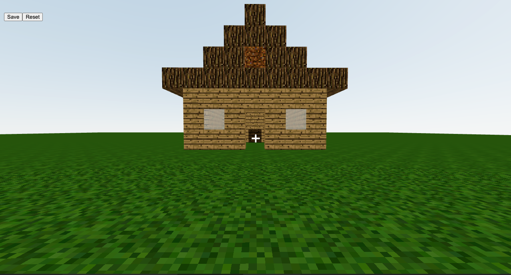

# Minecraft Clone

`npm install && npm start`

- [x] Boilerplate
- [x] Sky
- [x] Textures and images
- [X] Ground
- [X] Keyboard inputs
- [X] Player
- [x] First person view
- [x] Gravity
- [x] Movement
- [X] State management
- [X] Cubes
- [X] Adding cubes
- [X] Removing cubes
- [X] Cube type selector
- [X] Save world in localstorage
- [X] Hover state on cubes
- [X] Build a house

## References

- Tutorial video: <https://www.youtube.com/watch?v=qpOZup_3P_A>
- Tutorial code: <https://github.com/danba340/minecraft-freecodecamp>
